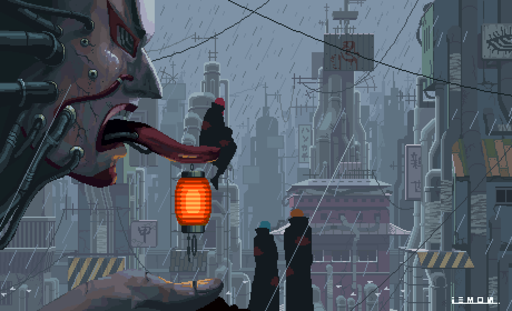

## Hello There!
#### My name is *Salwa Adlouni* I'm a 22 years old *I am a Software Engineer with expertise in DevOps.*.
<!-- - 🏦  Currently working as a Confirmed Full-stack Java Dev for Transactis, Paris. -->
- 📚 Have a solid foundation in Mathematics, Physics, Networks & Web Technologies.
- ⚡ Proficient in **Java**, **Javascript** and a bunch of other stuff .
- 💻 Currently getting better at Golang. 
- 💬 What's your favourite quote? Mine is : **If it doesn't work restart the VM.**
- 📖 Languages: English-Français-العربية-Deutsch.
- 🔺 Graduated from [École Nationale Supérieure d'Informatique et d'Analyse des Systèmes](http://ensias.um5.ac.ma/).
  

## Skills

	<!--Java-->
	
      	<!--JS-->
	
	<!--Python-->
	
	<!--Vue-->
	
	<!--Angular-->
	
	<!--SASS-->
	
	<!--Django-->
	
     	<!--Spring Boot-->
	
	<!--Postgres-->
	
	<!--Firebase-->
	
	<!--Docker-->
	
	<!--Git-->
	 
	<!--Golang-->
  
	<!--Terraform-->
	
	<!--Azure-->
	
	<!--Kubernetes-->
	

 
<h2> 📊 Github Stats </h2> 

